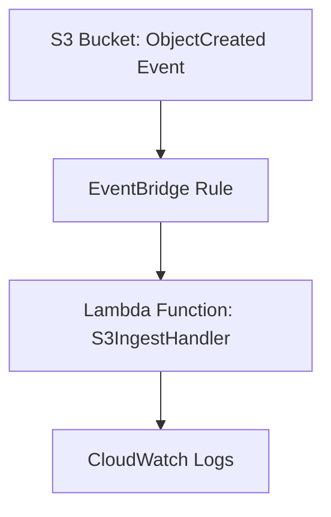
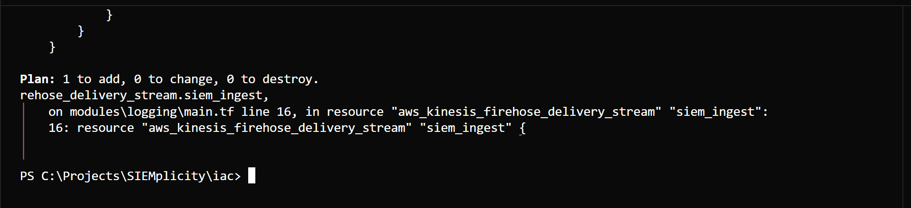

# SIEMplicity
Cloud Incident Response Automator (IaC + SIEM + Automation)

Event-driven AWS S3 + Lambda ingestion pipeline built with Terraform and Python. Automates file ingestion, logging, and CloudWatch monitoring via EventBridge triggers.

## Overview

This project demonstrates an event-driven architecture on AWS that enables near-real-time data ingestion and processing. The solution automatically triggers a Lambda function via EventBridge whenever an object is created in an S3 bucket, providing a scalable and serverless approach to data pipeline automation.

The project uses Terraform for infrastructure provisioning and includes a Python Lambda handler for processing incoming data files. This architecture is ideal for scenarios requiring immediate processing of uploaded files, such as data validation, transformation, or triggering downstream workflows.

## Architecture

The pipeline consists of four main components working together to create an automated data ingestion system:

- **S3** — stores incoming files and emits `ObjectCreated` events when new objects are uploaded
- **EventBridge Rule** — listens for S3 events and routes them to the appropriate Lambda function
- **Lambda Function** — processes the new object, performs any required transformations, and logs results to CloudWatch
- **CloudWatch** — monitors execution logs and provides observability for the entire pipeline

### System Flow



## Project Structure

```
SIEMplicity/
├── automation/
│   └── lambda_handler.py          # Python Lambda handler for S3 processing
├── docs/
│   └── eventbridge_rule_diagram.md # EventBridge routing documentation
├── iac/
│   ├── modules/
│   │   └── logging/              # Terraform logging module
│   └── *.tf                      # Terraform infrastructure configuration
└── README.md                     # Project documentation
```

## Getting Started

### Prerequisites

- AWS CLI configured with appropriate permissions
- Terraform installed
- Python 3.8+ (for Lambda handler development)

### Deployment

1. Navigate to the `iac/` directory
2. Initialize Terraform: `terraform init`
3. Plan the deployment: `terraform plan`
4. Apply the infrastructure: `terraform apply`

### Usage

Once deployed, simply upload files to the configured S3 bucket. The system will automatically:
1. Detect the new object via S3 events
2. Route the event through EventBridge
3. Trigger the Lambda function for processing
4. Log execution details to CloudWatch

## Monitoring

Monitor the pipeline through:
- **CloudWatch Logs**: View Lambda execution logs and any errors
- **CloudWatch Metrics**: Track invocation counts, duration, and error rates
- **AWS X-Ray**: Enable distributed tracing for detailed performance insights

AWS CLI Validation — SSO & VPC Verification

This section confirms successful AWS SSO authentication and validates that the SIEM architecture VPC (10.0.0.0/16) exists and is accessible via AWS CLI.

# Step 1 — Authenticate with AWS SSO
aws sso login --profile groundzero-lead


✅ Output: “Successfully logged into Start URL…”

📸 Screenshot #1: AWS_SSO_Login_Success_SIEMplicity.png

# Step 2 — Verify AWS Identity
aws sts get-caller-identity --profile groundzero-lead


✅ Output includes:

UserId: AROAQAIRFJYZHDFO7LRX:siem-arch-ld

Account: 000572870194

Arn: arn:aws:sts::000572870194:assumed-role/AWSReservedSSO_SIEM-Lead-Permissions...

📸 Screenshot #2: AWS_Caller_Identity_Verification.png

# Step 3 — List VPCs to verify SIEM architecture network
aws ec2 describe-vpcs --region us-east-1 --profile groundzero-lead


✅ Expected output:

vpc-0335b4396662249e3 → SIEM Architecture VPC (10.0.0.0/16)

vpc-02b7a8a81de897418 → Default AWS VPC (172.31.0.0/16)

📸 Screenshot #3: AWS_VPC_List_Verification.png

# (Optional) Export full VPC details for documentation
aws ec2 describe-vpcs --region us-east-1 --profile groundzero-lead > .\docs\SIEM_VPC_Details.json


📂 File: docs/SIEM_VPC_Details.json

✅ Verification Outcome

SSO authentication — Success

IAM Identity (Role = SIEM-Lead-Permissions) — Confirmed

VPC 10.0.0.0/16 ( siem-arch-ld-vpc ) — Active & Available


## Sprint 2 Deliverables

### 🧩 Sprint 2 – Deliverable 4: Logging Module (S3 + Firehose + OpenSearch)

**Objective:**  
Configure centralized logging infrastructure using Terraform to integrate S3 archival, Kinesis Firehose delivery, and OpenSearch analytics.

**Components Implemented:**
- S3 Archive Bucket with lifecycle and compression policy  
- Kinesis Firehose delivery stream for real-time ingestion  
- Integration with OpenSearch (endpoint pending)  
- IAM role configuration for Firehose and Lambda  

**Evidence:**
- 
- 
-   

**Status:** Completed (awaiting OpenSearch ingestion test)  
**Owner:** Latrisha Dodson (Data Quarantine Architect)

## Contributing

This project serves as a foundation for event-driven data processing pipelines. Extend the Lambda handler in `automation/lambda_handler.py` to implement your specific data processing requirements.

## Repository Topics

This repository is tagged with the following topics for easy discovery:

`aws` `terraform` `lambda` `eventbridge` `s3` `cloud-automation` `python` `devsecops` `infrastructure-as-code` `serverless`
=======


🚀 Sprint 3 Deliverables — Infrastructure & AWS CLI Verification

Objective:
Validate SIEM network infrastructure (VPC, subnets, route tables, NAT gateway, and security groups) through AWS CLI and ensure visibility across all team IAM roles.

Verification Evidence:

 AWS CLI SSO Login → Success

 IAM Role Validation → Role = SIEM-Lead-Permissions

 VPC ID vpc-0335b4396662249e3 active ( CIDR 10.0.0.0/16 )

 2 Public + 2 Private Subnets verified

 Routing confirmed (Public → IGW, Private → NAT)

 Security Groups (22 SSH + 5601 Kibana) active

📂 Evidence Files

/assets/Sprint3_VPC_Evidence/
  AWS_SSO_Login_Success_SIEMplicity.png
  AWS_Caller_Identity_Verification.png
  AWS_VPC_List_Verification.png
  AWS_VPC_Dashboard_View.png
  AWS_Subnet_Configuration.png
  AWS_RouteTables_Validation.png
  AWS_SecurityGroups_Validation.png
/docs/SIEM_VPC_Details.json


📜 Status: Completed (ready for Sprint 4 — EC2 Provisioning & Lambda Integration)
Owner: Latrisha Dodson (Data Quarantine Architect)


🗂️ Updated Repository Structure for Sprint 3 Evidence
SOC-it-to-EM-SIEMlessly/
├── automation/
│   └── lambda_handler.py
├── docs/
│   ├── SIEM_VPC_Details.json              # exported CLI verification file
│   ├── Sprint3_VPC_Setup_Steps.md         # optional detailed setup notes
│   └── eventbridge_rule_diagram.md
├── assets/
│   ├── Sprint3_VPC_Evidence/
│   │   ├── AWS_SSO_Login_Success_SIEMplicity.png
│   │   ├── AWS_Caller_Identity_Verification.png
│   │   ├── AWS_VPC_List_Verification.png
│   │   ├── AWS_VPC_Dashboard_View.png              # from console (final VPC view)
│   │   ├── AWS_Subnet_Configuration.png            # all public/private subnets shown
│   │   ├── AWS_RouteTables_Validation.png          # public → IGW; private → NAT
│   │   └── AWS_SecurityGroups_Validation.png       # confirms ports 22 and 5601
│   └── Sprint2_Deliverables/
│       ├── LocalOS_LoggingModule_Validation_Success.png
│       ├── Terraform_Firehose_AccessDenied.png
│       └── LocalOS_VPCDeployment_Success.png
├── iac/
│   ├── modules/
│   │   └── logging/
│   ├── main.tf
│   ├── variables.tf
│   └── outputs.tf
├── README.md
└── README_evidence.md
