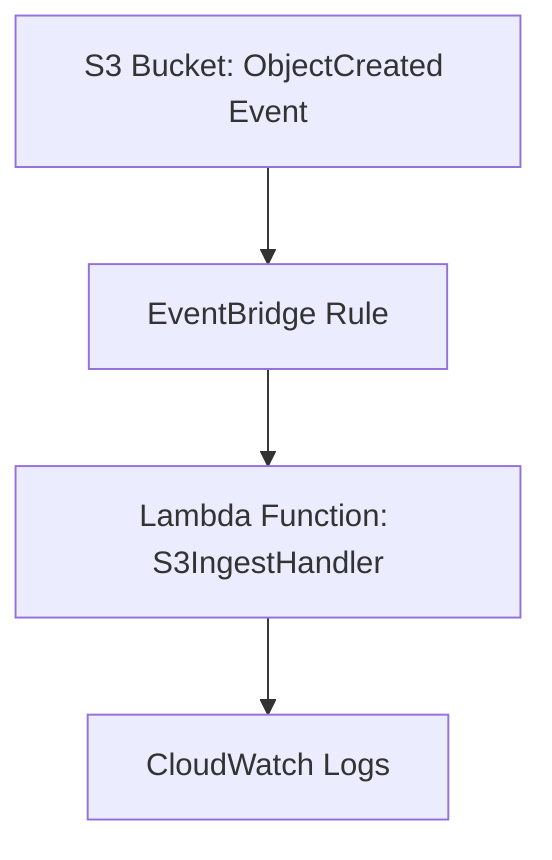

# SIEMplicity
Cloud Incident Response Automator (IaC + SIEM + Automation)

Event-driven AWS S3 + Lambda ingestion pipeline built with Terraform and Python. Automates file ingestion, logging, and CloudWatch monitoring via EventBridge triggers.

## Overview

This project demonstrates an event-driven architecture on AWS that enables near-real-time data ingestion and processing. The solution automatically triggers a Lambda function via EventBridge whenever an object is created in an S3 bucket, providing a scalable and serverless approach to data pipeline automation.

The project uses Terraform for infrastructure provisioning and includes a Python Lambda handler for processing incoming data files. This architecture is ideal for scenarios requiring immediate processing of uploaded files, such as data validation, transformation, or triggering downstream workflows.

## Architecture

The pipeline consists of four main components working together to create an automated data ingestion system:

- **S3** — stores incoming files and emits `ObjectCreated` events when new objects are uploaded
- **EventBridge Rule** — listens for S3 events and routes them to the appropriate Lambda function
- **Lambda Function** — processes the new object, performs any required transformations, and logs results to CloudWatch
- **CloudWatch** — monitors execution logs and provides observability for the entire pipeline

### System Flow



## Project Structure

```
SIEMplicity/
├── automation/
│   └── lambda_handler.py          # Python Lambda handler for S3 processing
├── docs/
│   └── eventbridge_rule_diagram.md # EventBridge routing documentation
├── iac/
│   ├── modules/
│   │   └── logging/              # Terraform logging module
│   └── *.tf                      # Terraform infrastructure configuration
└── README.md                     # Project documentation
```

## Getting Started

### Prerequisites

- AWS CLI configured with appropriate permissions
- Terraform installed
- Python 3.8+ (for Lambda handler development)

### Deployment

1. Navigate to the `iac/` directory
2. Initialize Terraform: `terraform init`
3. Plan the deployment: `terraform plan`
4. Apply the infrastructure: `terraform apply`

### Usage

Once deployed, simply upload files to the configured S3 bucket. The system will automatically:
1. Detect the new object via S3 events
2. Route the event through EventBridge
3. Trigger the Lambda function for processing
4. Log execution details to CloudWatch

## Monitoring

Monitor the pipeline through:
- **CloudWatch Logs**: View Lambda execution logs and any errors
- **CloudWatch Metrics**: Track invocation counts, duration, and error rates
- **AWS X-Ray**: Enable distributed tracing for detailed performance insights

## Sprint 2 Deliverables

### 🧩 Sprint 2 – Deliverable 4: Logging Module (S3 + Firehose + OpenSearch)

**Objective:**  
Configure centralized logging infrastructure using Terraform to integrate S3 archival, Kinesis Firehose delivery, and OpenSearch analytics.

**Components Implemented:**
- S3 Archive Bucket with lifecycle and compression policy  
- Kinesis Firehose delivery stream for real-time ingestion  
- Integration with OpenSearch (endpoint pending)  
- IAM role configuration for Firehose and Lambda  

**Evidence:**
- 
- 
-   

**Status:** Completed (awaiting OpenSearch ingestion test)  
**Owner:** Latrisha Dodson (Data Quarantine Architect)

## Contributing

This project serves as a foundation for event-driven data processing pipelines. Extend the Lambda handler in `automation/lambda_handler.py` to implement your specific data processing requirements.

## Repository Topics

This repository is tagged with the following topics for easy discovery:

`aws` `terraform` `lambda` `eventbridge` `s3` `cloud-automation` `python` `devsecops` `infrastructure-as-code` `serverless`
=======
