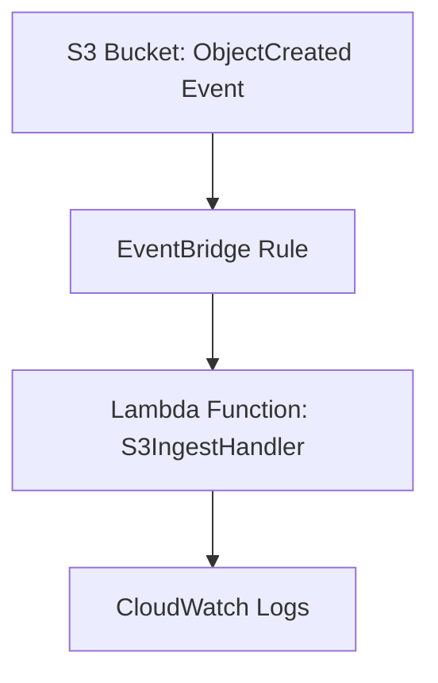

# SOC it to ’EM SIEMlessly  
*Automating cloud incident response with serverless precision — SOC it to ’EM SIEMlessly.*

SOC it to ’EM SIEMlessly is a cloud-native incident response automation framework built on AWS. It streamlines detection, containment, and evidence collection for Security Operations Center (SOC) environments using Terraform, Lambda, and EventBridge. Designed for scalability and automation, the system bridges DevSecOps principles with real-time monitoring—delivering a unified, serverless approach to SIEM orchestration and cloud defense.

## Overview

This project demonstrates an event-driven architecture on AWS that enables near-real-time data ingestion and processing. The solution automatically triggers a Lambda function via EventBridge whenever an object is created in an S3 bucket, providing a scalable and serverless approach to data pipeline automation.

The project uses Terraform for infrastructure provisioning and includes a Python Lambda handler for processing incoming data files. This architecture is ideal for scenarios requiring immediate processing of uploaded files, such as data validation, transformation, or triggering downstream workflows.

## Architecture

The pipeline consists of four main components working together to create an automated data ingestion system:

- **S3** — stores incoming files and emits `ObjectCreated` events when new objects are uploaded
- **EventBridge Rule** — listens for S3 events and routes them to the appropriate Lambda function
- **Lambda Function** — processes the new object, performs any required transformations, and logs results to CloudWatch
- **CloudWatch** — monitors execution logs and provides observability for the entire pipeline

### System Flow



## Project Structure

```
SIEMplicity/
├── automation/
│   └── lambda_handler.py          # Python Lambda handler for S3 processing
├── docs/
│   └── eventbridge_rule_diagram.md # EventBridge routing documentation
├── iac/
│   ├── modules/
│   │   └── logging/              # Terraform logging module
│   └── *.tf                      # Terraform infrastructure configuration
└── README.md                     # Project documentation
```

## Getting Started

### Prerequisites

- AWS CLI configured with appropriate permissions
- Terraform installed
- Python 3.8+ (for Lambda handler development)

### Deployment

1. Navigate to the `iac/` directory
2. Initialize Terraform: `terraform init`
3. Plan the deployment: `terraform plan`
4. Apply the infrastructure: `terraform apply`

### Usage

Once deployed, simply upload files to the configured S3 bucket. The system will automatically:
1. Detect the new object via S3 events
2. Route the event through EventBridge
3. Trigger the Lambda function for processing
4. Log execution details to CloudWatch

## Monitoring

Monitor the pipeline through:
- **CloudWatch Logs**: View Lambda execution logs and any errors
- **CloudWatch Metrics**: Track invocation counts, duration, and error rates
- **AWS X-Ray**: Enable distributed tracing for detailed performance insights

AWS CLI Validation — SSO & VPC Verification

This section confirms successful AWS SSO authentication and validates that the SIEM architecture VPC (10.0.0.0/16) exists and is accessible via AWS CLI.

# Step 1 — Authenticate with AWS SSO
aws sso login --profile groundzero-lead


✅ Output: “Successfully logged into Start URL…”

📸 Screenshot #1: AWS_SSO_Login_Success_SIEMplicity.png

# Step 2 — Verify AWS Identity
aws sts get-caller-identity --profile groundzero-lead


✅ Output includes:

UserId: AROAQAIRFJYZHDFO7LRX:siem-arch-ld

Account: 000572870194

Arn: arn:aws:sts::000572870194:assumed-role/AWSReservedSSO_SIEM-Lead-Permissions...

📸 Screenshot #2: AWS_Caller_Identity_Verification.png

# Step 3 — List VPCs to verify SIEM architecture network
aws ec2 describe-vpcs --region us-east-1 --profile groundzero-lead


✅ Expected output:

vpc-0335b4396662249e3 → SIEM Architecture VPC (10.0.0.0/16)

vpc-02b7a8a81de897418 → Default AWS VPC (172.31.0.0/16)

📸 Screenshot #3: AWS_VPC_List_Verification.png

# (Optional) Export full VPC details for documentation
aws ec2 describe-vpcs --region us-east-1 --profile groundzero-lead > .\docs\SIEM_VPC_Details.json


📂 File: docs/SIEM_VPC_Details.json

✅ Verification Outcome

SSO authentication — Success

IAM Identity (Role = SIEM-Lead-Permissions) — Confirmed

VPC 10.0.0.0/16 ( siem-arch-ld-vpc ) — Active & Available


## Sprint 2 Deliverables

### 🧩 Sprint 2 – Deliverable 4: Logging Module (S3 + Firehose + OpenSearch)

**Objective:**  
Configure centralized logging infrastructure using Terraform to integrate S3 archival, Kinesis Firehose delivery, and OpenSearch analytics.

**Components Implemented:**
- S3 Archive Bucket with lifecycle and compression policy  
- Kinesis Firehose delivery stream for real-time ingestion  
- Integration with OpenSearch (endpoint pending)  
- IAM role configuration for Firehose and Lambda  

**Evidence:**
- 
- 
-   

**Status:** Completed (awaiting OpenSearch ingestion test)  
**Owner:** Latrisha Dodson (Data Quarantine Architect)


🧩 Sprint 3 Deliverables — AWS VPC Setup & Verification

Objective:
Design and validate a secure Virtual Private Cloud (VPC) architecture supporting the SOC-as-a-Service environment for SOC it to ’EM SIEMlessly.
This phase confirms networking fundamentals — VPC creation, subnet segmentation, route tables, NACLs, and security groups — deployed through AWS CLI and verified via Terraform and SSO CLI sessions.

🧠 Key Validation Tasks

Configured and verified VPC, subnets, route tables, and internet gateway.

Established public/private subnet associations and NAT gateway for egress traffic.

Implemented Network ACLs (NACLs) for traffic control and segmentation.

Created Security Groups for SSH (22), HTTP (80), and HTTPS (443) access.

Validated resource existence and permissions via AWS CLI profile (groundzero-lead).

📂 Evidence Files Location

docs/evidence/VPC_Setup_Group/

🧾 Evidence Screenshots and Descriptions
Screenshot	Description	Validation Stage
VPC_Creation_Success.png	VPC created and associated with us-east-1 region via Terraform.	Provisioning
Subnets_Configured_Success.png	All four subnets (public & private) successfully created and associated with route tables.	Subnet Layer
RouteTables_Configured_Success.png	Public and private route tables configured for NAT and internet gateway routing.	Routing
NATGateway_Configured.png	NAT gateway deployed and verified for private subnet egress.	Connectivity
Private_NACL_Rules.png	Private NACL inbound/outbound rules configured for restricted traffic flows.	Network Security
Public_NACL_Rules.png	Public NACL configured for open inbound HTTP/HTTPS and SSH.	Network Security
SecurityGroups_Configured_Success.png	Security Group siem-public-sg allowing TCP ports 22, 80, 443 for public instances.	Access Control
AWS_Caller_Identity_Verification.png	CLI confirmation of active IAM role siem-arch-ld under AWS Reserved SSO permissions.	Authentication
AWS_VPC_List_Verification.png	AWS CLI command describe-vpcs output confirming VPC ID and CIDR association.	Validation
🧩 CLI Validation Outputs

Additional verification artifacts are stored in:

VPC_Region_Scan_Results.txt — Region-wide VPC scan output

AWS_SSO_Login_Success_SIEMplicity.png — Authenticated CLI session screenshot

✅ Status

Completed – All AWS VPC components successfully created and validated.
Documentation and screenshots ready for peer review and GitHub submission.


## Contributing

This project serves as a foundation for event-driven data processing pipelines. Extend the Lambda handler in `automation/lambda_handler.py` to implement your specific data processing requirements.

## Repository Topics

This repository is tagged with the following topics for easy discovery:

`aws` `terraform` `lambda` `eventbridge` `s3` `cloud-automation` `python` `devsecops` `infrastructure-as-code` `serverless`
=======


🚀 Sprint 3 Deliverables — Infrastructure & AWS CLI Verification

Objective:
Validate SIEM network infrastructure (VPC, subnets, route tables, NAT gateway, and security groups) through AWS CLI and ensure visibility across all team IAM roles.

Verification Evidence:

 AWS CLI SSO Login → Success

 IAM Role Validation → Role = SIEM-Lead-Permissions

 VPC ID vpc-0335b4396662249e3 active ( CIDR 10.0.0.0/16 )

 2 Public + 2 Private Subnets verified

 Routing confirmed (Public → IGW, Private → NAT)

 Security Groups (22 SSH + 5601 Kibana) active

📂 Evidence Files

/assets/Sprint3_VPC_Evidence/
  AWS_SSO_Login_Success_SIEMplicity.png
  AWS_Caller_Identity_Verification.png
  AWS_VPC_List_Verification.png
  AWS_VPC_Dashboard_View.png
  AWS_Subnet_Configuration.png
  AWS_RouteTables_Validation.png
  AWS_SecurityGroups_Validation.png
/docs/SIEM_VPC_Details.json


📜 Status: Completed (ready for Sprint 4 — EC2 Provisioning & Lambda Integration)
Owner: Latrisha Dodson (Data Quarantine Architect)

```
📁 Updated Repository Structure for Sprint 3 Evidence

SOC-it-to-EM-SIEMlessly/
├── assets/
│ └── Sprint2_Deliverables/
│ ├── LocalOS_LoggingModule_README_Generated_Config.png
│ ├── LocalOS_LoggingModule_Validation_Success.png
│ ├── LocalOS_VPCDeployment_Success.png
│ ├── Terraform_Firehose_ConfigGenerated.png
│ ├── Terraform_Firehose_S3_Config_Block.png
│ ├── Terraform_Init_Success.png
│ ├── Terraform_Validate_Success.png
│ └── Terraform_Variables_Update_FirehoseRole.png
│
├── automation/
│ ├── .gitkeep
│ └── lambda_handler.py
│
├── config/
│ └── .gitkeep
│
├── diagrams/
│ └── .gitkeep
│
├── docs/
│ ├── SIEM_VPC_Details.json
│ ├── Sprint3_VPC_Setup_Steps.md
│ └── eventbridge_rule_diagram.md
│
├── iac/
│ ├── main.tf
│ ├── outputs.tf
│ ├── variables.tf
│ └── modules/
│ └── logging/
│
├── ingestion/
│ └── aws-s3-lambda-ingestion/
│ ├── main.tf
│ ├── variables.tf
│ └── outputs.tf
│
├── siem/
│ ├── main.tf
│ ├── variables.tf
│ └── outputs.tf
│
├── vpc/
│ ├── main.tf
│ ├── outputs.tf
│ └── variables.tf
│
├── .cursorprompt.json
├── .gitignore
├── README.md
├── README_evidence.md
└── VPC_Region_Scan_Results.txt
```

## 📸 Evidence & Verification  

All Git operations, merges, and structural updates were validated using **Visual Studio Code** and **Git CLI**, then visually confirmed via rendered GitHub repository view.

### ✅ Local Commit & Push Evidence  
📁 `docs/screenshots/LocalOS_GitPush_Success_SIEMlessly.png`  
> Demonstrates successful local Git commit and push operations from VS Code terminal, confirming branch synchronization.

### 🧱 Repository Structure Code Verification  
📁 `docs/screenshots/README_Structure_CodeBlock.png`  
> Captures the verified Markdown tree structure rendered correctly within VS Code before commit.

### 🌐 GitHub Render Confirmation  
📁 `docs/screenshots/GitHub_RepoStructure_Rendered_Success.png`  
> Confirms successful rendering of the updated repository structure section on GitHub, verifying Markdown formatting and file integrity.

---

**Verification Summary:**  
All evidence confirms the `feature/siemplicity-vpc-stable` branch was correctly synchronized between local and remote repositories.  
Repository formatting, evidence documentation, and commit integrity were validated as part of **Sprint 3** deliverables under *Data Quarantine Architect (Latrisha Dodson)*.

---

# SOC it to ’EM SIEMlessly

*A Multi-Account Cloud Governance, Logging, and Threat Detection Architecture on AWS*

---

## 📌 Project Summary

SOC it to ’EM SIEMlessly is a cloud-native, multi-account SIEM and governance architecture that centralizes audit logging, threat detection, and compliance enforcement across AWS environments.

The system integrates:

- AWS Organizations (intended multi-account design)
- Security Hub, GuardDuty, Inspector (delegated admin model)
- CloudTrail (multi-region)
- VPC Flow Logs
- S3 Log Archive with versioning and encryption
- Glue Data Catalog + Athena
- EventBridge → Lambda → OpenSearch pipeline
- Terraform IaC modules (logging, SIEM, ingestion, VPC)
- Restricted-role AWS SSO access for separation of duties

This README distinguishes:

1. Intended enterprise architecture  
2. Components manually validated during Sprint 4 under the SIEM-Data-Architect read-only role  

---

## 1. Architecture Overview

The validated AWS SIEM/governance architecture unifies:

- CloudTrail log delivery  
- VPC Flow Logs → S3  
- Glue + Athena schema and query layer  
- Security Hub, GuardDuty, Inspector  
- EventBridge → Lambda ETL path  
- OpenSearch dashboards  
- Delegated administrator governance model  
- Multi-account structure (Management → Log Archive → Security Tooling → Member Accounts)

---

## 2. Intended Multi-Account Governance Architecture

Although the restricted SSO role prevented provisioning, the capstone includes a complete enterprise design.

### 2.1 Organizational Structure

- Management Account  
- Log Archive Account  
- Security Tooling Account  
- Multiple Member Accounts  

### 2.2 Delegated Administrator Assignments

- Security Hub  
- GuardDuty  
- Inspector  

### 2.3 Cross-Account Log Aggregation

| Source           | Log Type          | Destination   | Mechanism                            |
|------------------|-------------------|---------------|--------------------------------------|
| Member Accounts  | CloudTrail        | Log Archive   | S3 log bucket                        |
| Member Accounts  | VPC Flow Logs     | Log Archive   | VPC Flow Logs                        |
| Member Accounts  | Security Findings | Security Tooling | EventBridge + Delegated Admin   |

### 2.4 Query & Analytics Layer

- Glue defines schema  
- Athena queries S3  
- Lambda → OpenSearch indexes findings  

---

## 3. Manually Validated Components (Sprint 4)

Executed under the **SIEM-Data-Architect (Read-Only)** SSO role.

### 3.1 CloudTrail (Multi-Region)

- Validated event history  
- Confirmed account-level governance  
- Verified permission boundaries preventing trail creation  

**Evidence**  
`./sprint4/evidence/s4_cloudtrail_view_only.png`

### 3.2 S3 Central Log Archive

Bucket: `gvrdc-central-logs-ld-us-east-1`

- Versioning enabled  
- SSE encryption verified  
- CloudTrail and Flow Logs delivery confirmed  

**Evidence**  
`./sprint4/evidence/s4_s3_log_archive_bucket.png`

### 3.3 VPC Flow Logs → S3 Delivery

- Located FlowLogs folder and log files  
- Verified log record structure  

**Evidence**  
`./sprint4/evidence/s4_flowlogs_s3_delivery.png`

### 3.4 Athena (Read-Only Validation)

- Verified workgroups and query history  
- Captured permission boundaries for DDL operations  

**Evidence**  
`./sprint4/evidence/s4_athena_read_only.png`

### 3.5 Security Hub / GuardDuty / Inspector – View-Only

- Confirmed findings display  
- Confirmed modification limitations  

**Evidence**  
`./sprint4/evidence/s4_security_services_view_only.png`

### 3.6 Glue – Access Denied (Expected)

- Validated that Glue database creation is blocked by role policy  

**Evidence**  
`./sprint4/evidence/s4_glue_access_denied.png`

### 3.7 Final System Architecture Diagram

**Evidence**  
`./sprint4/Architecture_Diagram.png`

---

## 4. Sprint Documentation (Sprints 1–4)

### 4.1 Sprint 1 — Foundations

**Completed**

- Repository setup  
- Initial SIEM architecture scoping  
- AWS SSO login  
- IAM role boundary identification  

**Evidence**

| Description                          | File                                                              |
|--------------------------------------|-------------------------------------------------------------------|
| Permission denied – Security Services | `./sprint1/evidence/s1_permission_denied_security_services.png`  |
| CloudTrail create denied             | `./sprint1/evidence/s1_cloudtrail_create_denied.png`             |
| General permission boundary          | `./sprint1/evidence/s1_permission_boundary_general.png`          |
| AWS Console access                   | `./sprint1/evidence/s1_aws_console_access.png`                   |
| Architecture planning                | `./sprint1/evidence/s1_architecture_planning.png`                |

---

### 4.2 Sprint 2 — Logging Module (Terraform)

**Completed**

- S3 archival bucket architecture  
- Firehose ingestion planning  
- Terraform initialization and validation  
- Logging module directory verification  

**Evidence**

| Description                       | File                                                       |
|-----------------------------------|------------------------------------------------------------|
| AWS STS identity verification     | `./sprint2/evidence/s2_aws_sts_identity.png`              |
| Terraform init                    | `./sprint2/evidence/s2_terraform_init.png`                |
| Terraform plan / output           | `./sprint2/evidence/s2_terraform_plan_output.png`         |
| Logging S3 bucket                 | `./sprint2/evidence/s2_s3_logging_bucket.png`             |
| Logging module directory          | `./sprint2/evidence/s2_logging_module_directory.png`      |
| Logging pipeline design           | `./sprint2/evidence/s2_logging_pipeline_design.png`       |

---

### 4.3 Sprint 3 — VPC Architecture & AWS CLI Validation

**Completed**

- VPC creation  
- Subnets (public and private)  
- Route tables  
- NAT Gateway  
- NACLs  
- Security groups  

**Evidence**

| Description          | File                                                  |
|----------------------|-------------------------------------------------------|
| VPC dashboard        | `./sprint3/evidence/s3_vpc_dashboard.png`            |
| Subnets view         | `./sprint3/evidence/s3_subnets_view.png`             |
| Route tables         | `./sprint3/evidence/s3_route_tables.png`             |
| IGW and NAT Gateway  | `./sprint3/evidence/s3_internet_nat_gateway.png`     |
| NACL configuration   | `./sprint3/evidence/s3_nacls.png`                    |
| Security groups      | `./sprint3/evidence/s3_security_groups.png`          |

---

### 4.4 Sprint 4 — Governance Components (Manual Provisioning)

*(Performed under restricted SSO role)*

**Completed**

- CloudTrail validation  
- S3 Log Archive verification  
- Flow Log parsing  
- Athena read-only validation  
- Security services read-only validation  
- Glue access-denied confirmation  
- Final architecture diagram generation  

**Evidence**

| Description                | File                                                       |
|----------------------------|------------------------------------------------------------|
| CloudTrail view-only       | `./sprint4/evidence/s4_cloudtrail_view_only.png`          |
| Central log archive bucket | `./sprint4/evidence/s4_s3_log_archive_bucket.png`         |
| Flow Logs → S3             | `./sprint4/evidence/s4_flowlogs_s3_delivery.png`          |
| Athena read-only           | `./sprint4/evidence/s4_athena_read_only.png`              |
| Security services view-only| `./sprint4/evidence/s4_security_services_view_only.png`   |
| Glue access denied         | `./sprint4/evidence/s4_glue_access_denied.png`            |
| Architecture diagram       | `./sprint4/Architecture_Diagram.png`                      |

---

## 5. Repository Structure

```text
SOC-it-to-EM-SIEMlessly/
├── sprint1/
│   └── evidence/
├── sprint2/
│   └── evidence/
├── sprint3/
│   └── evidence/
├── sprint4/
│   ├── Architecture_Diagram.png
│   └── evidence/
├── iac/
├── ingestion/
├── vpc/
├── automation/
├── docs/
├── README.md
└── README_evidence.md

6. Restricted SSO Role — Capabilities vs. Limitations

6.1 Capabilities
*View CloudTrail logs
*View VPC Flow Logs
*Query Athena (read-only)
*View Security Hub, GuardDuty, Inspector
*Access S3 Log Archive

6.2 Limitations
*Cannot create CloudTrail
*Cannot create Glue databases or tables
*Cannot create DynamoDB
*Cannot modify Security services
*Cannot run Athena DDL
*Cannot deploy CloudFormation

7. Future Enhancements
*Automated delegated admin provisioning
*Glue ETL normalization workflows
*Security Hub → Lambda → OpenSearch ingestion
*Automated remediation using EventBridge
*Multi-account SIEM ingestion pipeline
*Managed “SIEM-as-a-Service” model for SMBs